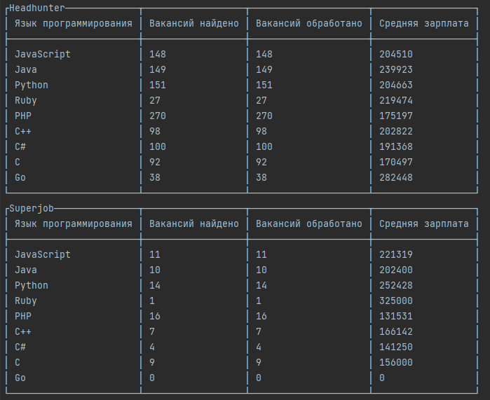

## Средняя зарплата по языкам программирования в Москве.

Скрипт рассчитывает среднюю зарплату по наиболее популярным языкам программирования на 2022 год.<br>

Данные для расчета взяты с api Headhunter и Superjob.<br>



#### Параметры поиска<br>
**Город**: Москва.<br>
**Область поиска**: в названии вакансии.<br>
**Зарплата**: только вакансии с зарплатой.<br>
**Период**: вакансии за 30 дней.<br>
**Валюта**: Зарплата указана в рублях.


### Установка:
1. Скачайте проект:<br>

```commandline
git clone https://github.com/NankuF/average_salary_of_programming_languages.git
```

2. Создайте виртуальное окружение:<br>

```commandline
python -m venv venv
```

3. Перейдите в директорию:

```commandline
cd average_salary_of_programming_languages
```

4. Установите зависимости:<br>

```commandline
pip install -r requirements.txt
```

6. Создайте файл `.env` и укажите следующие переменные:<br>

```commandline
SUPERJOB_SECRET_KEY='your_secret_key'
```

`SUPERJOB_SECRET_KEY` - ключ для доступа к api Superjob: https://api.superjob.ru/register <br>

7. Запуск:

```commandline
python main.py
```