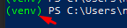

## Сбор вакансий и ключевых навыков профессии Headhunter в файлы excel и txt.

Скрипт может собирать вакансии в файл excel.<br>
<br>
Скрипт может собрать ключевые навыки профессии в файл txt.<br>
<br>
Данные взяты с api Headhunter.<br>

### Требования:
- Python выше 3.5 (проект написан на версии 3.10) 
- git

### Запуск под Windows:<br>
1. Перейдите в директорию `for windows`<br>
2. Скачайте и запустите .exe файлы.<br>

### Установка и запуск для Unix:

1. Скачайте проект:<br>

```commandline
git clone https://github.com/NankuF/search_vacancies.git
```

2. Перейдите в директорию:<br>

```commandline
cd search_vacancies
```

3. Создайте виртуальное окружение:<br>

```commandline
python -m venv venv
```

4. Активируйте окружение:<br>

```commandline
. ./venv/bin/activate
```
5. Установите зависимости:<br>

```commandline
pip install -r requirements.txt
```

6. Запуск:<br>
   `--vacancy` - Название вакансии.<br>
   `--location`- Можно ввести город, регион или страну.<br>
   `--need_salary` - Укажите этот ключ, если хотите увидеть вакансии с указанной зарплатой.<br>
   `--period` - За какой период искать работу. Указать количество дней. Максимум 30.<br>
   `--schedule` - График работы: remote | fullDay | shift | flexible (
   удаленная работа; полный день; сменный график; гибкий график).
   Этот ключ можно не указывать.

```commandline
python main.py --vacancy "Программист Python" --location "Санкт-Петербург" --need_salary --period 30 --schedule "remote"

```

```commandline
python main.py --vacancy "Уборщица" --location "Краснодарский край" --period 7

```

```commandline
python main.py --vacancy "Прораб" --location "Россия" --period 1

```


### Вакансии сохраняются в папке `vacancies`
### Ключевые навыки сохраняются в папке `skills`
