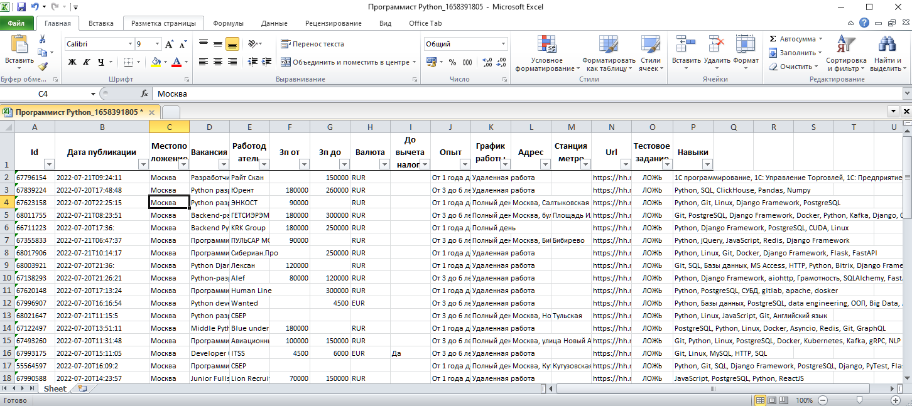
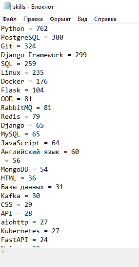

# Отклик на вакансии, сбор вакансий и ключевых навыков в Headhunter
#### UPD 19.09.2022: приложение требуется GUI, т.к. раз в 14 дней истекают куки пользователя и необходима его авторизация в браузере с поддержкой javascript.
Если вы желаете получить только список вакансий и ключевые навыки - проще всего запустить файлы с расширением `exe` под Windows из папки `for windows`.

### Возможности приложения
1. Сбор вакансии в файл excel.
   <details>
     <summary>Фото</summary>
      
   </details>

2. Сбор ключевых навыков в файл txt.
   <details>
     <summary>Фото</summary>
      
   </details>

3. Отклик на вакансии.

### Требования для разработчиков:
- Python 3.8.
- git.
- созданное приложение на [dev.hh.ru](https://dev.hh.ru/admin).
- файл `.env` с секретными ключами.
### Запуск под Windows:<br>
  - Скачайте и запустите .exe файлы.<br>
  Собрать вакансии - [скачать](https://github.com/NankuF/search_vacancies/raw/master/for%20windows/get_vacancies.exe)<br>
  Собрать ключевые навыки - [скачать](https://github.com/NankuF/search_vacancies/raw/master/for%20windows/get_skills.exe)<br>
  Отклик на вакансии - не реализовано под Windows.


### Установка приложения в Unix:

1. Скачайте проект:<br>

```commandline
git clone https://github.com/NankuF/search_vacancies.git
```

2. Перейдите в директорию:<br>

```commandline
cd search_vacancies
```

3. Создайте виртуальное окружение:<br>

```commandline
python -m venv venv
```

4. Активируйте окружение:<br>

```commandline
. ./venv/bin/activate
```
5. Установите зависимости:<br>

```commandline
pip install -r requirements.txt
```
6. Создайте приложение на [dev.hh.ru](https://dev.hh.ru/admin).
7. Добавьте файл .env и заполните его следующими данными<br>
`TELETHON_API_ID` - id вашего приложения [в телеграм](https://my.telegram.org/apps).<br>
`TELETHON_API_HASH` - hash вашего приложения [в телеграм](https://my.telegram.org/apps).<br>
`PRIVATE_CHANNEL_ID` - id вашего приватного телеграм-канала.<br>
`HH_RESUME_NAME` - название вашего резюме.<br>
`HH_VACANCIES_AMOUNT=2` - отклик на 2 вакансии за один раз.<br>
`HH_INTERVAL=3600` - интервал между откликами на вакансии (2 отклика - интервал - 2 отклика - интервал...).<br>
`HH_CLIENT_ID` - взять `Client ID` с [dev.hh.ru](https://dev.hh.ru/admin).<br>
`HH_CLIENT_SECRET` - взять `Client Secret` с [dev.hh.ru](https://dev.hh.ru/admin). <br>
`HH_APP_ACCESS_TOKEN` - взять `Токен приложения` с [dev.hh.ru](https://dev.hh.ru/admin).<br>

```text
TELETHON_API_ID=your id
TELETHON_API_HASH=your hash
PRIVATE_CHANNEL_ID=-1001234567890  (your channel id)
HH_RESUME_NAME=Junior+ Python developer
HH_VACANCIES_AMOUNT=2
HH_INTERVAL=3600
HH_CLIENT_ID=client_id_in_your_app
HH_CLIENT_SECRET=client_secret_in_your_app
HH_APP_ACCESS_TOKEN=will be added automatically after authorization

```
Создайте файл `.user`. В него добавятся автоматические следующие данные
`HH_USER_ACCESS_TOKEN` - данные сохранятся в `.env` автоматически.<br>
`HH_USER_REFRESH_TOKEN` - данные сохранятся в `.env` автоматически.<br>
```text
HH_USER_ACCESS_TOKEN=will be added automatically after authorization
HH_USER_REFRESH_TOKEN=will be added automatically after authorization
```
## Запуск
### Сбор вакансий и ключевых навыков
   `--vacancy` - Название вакансии.<br>
   `--location`- Можно ввести город, регион или страну.<br>
   `--need_salary` - Укажите этот ключ, если хотите увидеть вакансии с указанной зарплатой.<br>
   `--period` - За какой период искать работу. Указать количество дней. Максимум 30.<br>
   `--schedule` - График работы: remote | fullDay | shift | flexible (
   удаленная работа; полный день; сменный график; гибкий график).
   Этот ключ можно не указывать.<br>
   **Вакансии сохраняются в папке `vacancies`**<br>
   **Ключевые навыки сохраняются в папке `skills`**<br>
```commandline
python main.py --vacancy "Программист Python" --location "Санкт-Петербург" --need_salary --period 30 --schedule "remote"

```

```commandline
python main.py --vacancy "Уборщица" --location "Краснодарский край" --period 7

```

```commandline
python main.py --vacancy "Прораб" --location "Россия" --period 1

```

### Отклик на вакансии
```commandline
python apply_vacancies.py
```
#### Подключение телеграм
**UPD 20.09.2022** - добавлена возможность отправлять отклик в ваш приватный телеграм канал.<br>
Зарегистрируйте ваше приложение [в телеграм](https://my.telegram.org/apps).<br>
Добавьте `App api_id` и `App api_hash` в .env как `TELETHON_API_ID` и `TELETHON_API_HASH`<br>
Создайте свой приватный канал в телеграм, и скопируйте его id из url, добавив к нему -100.<br>
Например https://web.telegram.org/z/#777000   = -100777000. Это значение сохраните в .env в переменной `PRIVATE_CHANNEL_ID`.<br>
При первом запуске приложения потребуется создать сессию, введя номер телефона и код. Не забудьте передать эту сессию в контейнер,
положив ее в директорию `logs` на вашем хосте.
#### Запуск в контейнере
1. Создать образ
```commandline
docker build . -t apply_vacancies
```
2. Запустить контейнер
```commandline
docker run -d --restart unless-stopped\
 --name apply_vacancies\
 -v $(pwd)/logs:/app/logs\
 -e TZ=$(cat /etc/timezone)\
 --env-file .env\
 --env-file .user\
 apply_vacancies
```